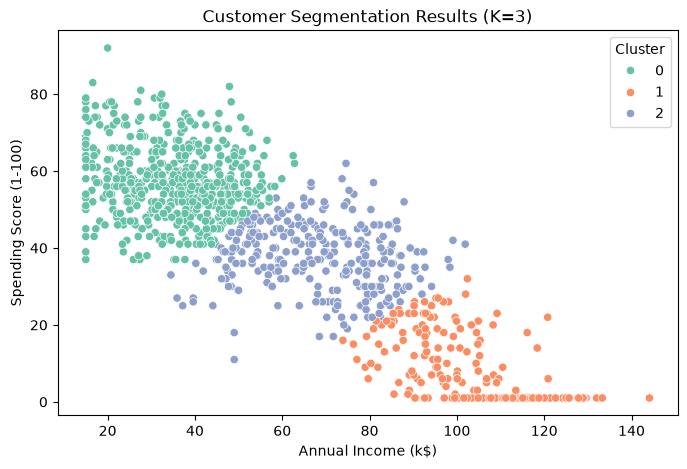

# Customer Segmentation Using K-Means Clustering

## Project Overview

This project applies unsupervised machine learning techniques to identify meaningful customer segments based on purchasing behavior.

The objective is to transform customer data into actionable business insights by discovering groups of customers with similar characteristics and designing targeted marketing strategies for each segment.

The project follows a complete data science workflow:

* Data loading and quality inspection
* Exploratory data analysis
* Data preprocessing
* Feature selection
* K-Means clustering optimization
* Customer segment analysis
* Business strategy recommendation

---

# Business Objective

Customer segmentation helps businesses understand different customer groups and improve decision-making in areas such as:

* Marketing campaigns
* Customer retention
* Personalized recommendations
* Product strategy

The key question explored in this project:

> Can customers be grouped into meaningful segments based on their income level and spending behavior?

---

# Dataset

The dataset contains customer demographic and behavioral information.

Features include:

| Feature                | Description                      |
| ---------------------- | -------------------------------- |
| CustomerID             | Unique customer identifier       |
| Gender                 | Customer gender                  |
| Age                    | Customer age                     |
| Annual Income (k$)     | Annual income level              |
| Spending Score (1-100) | Customer spending behavior score |

Dataset size:

* 1,000 customer records
* 5 original features

---

# Methodology

## 1. Exploratory Data Analysis

Initial analysis was performed to understand:

* Data distribution
* Missing values
* Feature relationships
* Customer behavior patterns

Key observations:

* Income and age showed strong correlation, making age less informative for segmentation.
* Income and spending score showed a negative relationship.
* Customer behavior appeared to contain several distinct groups.

---

## 2. Feature Selection

For clustering, the following features were selected:

* Annual Income (k$)
* Spending Score (1-100)

Reason:

These features directly represent customer purchasing power and engagement level.

Age and gender were excluded because they provided limited additional information for distinguishing customer purchasing behavior.

---

## 3. Data Preprocessing

The preprocessing pipeline includes:

### Missing Value Handling

Missing numerical values were handled using median imputation.

Median imputation was selected because it is robust against extreme values.

### Feature Scaling

StandardScaler was applied before K-Means clustering.

This ensures both features contribute equally during distance-based clustering.

---

# 4. Selecting the Optimal Number of Clusters

The optimal number of clusters was evaluated using:

## Elbow Method

The elbow method was used to analyze the reduction of within-cluster variation as the number of clusters increased.

## Silhouette Score

Silhouette score was used to measure how well-separated each cluster was.

Results:

| K | Silhouette Score |
| - | ---------------- |
| 2 | 0.58             |
| 3 | 0.47             |
| 4 | 0.39             |
| 5 | 0.37             |

Although K=2 achieved the highest silhouette score, K=3 provided a more meaningful business segmentation.

---

# Final Clustering Result

K-Means clustering with **K=3** was selected.

The three customer segments are:



---

# Customer Segment Analysis

## Cluster 0 — Budget High-Engagement Customers

Characteristics:

* Lower income customers
* Higher spending score

Average profile:

| Metric         |    Value |
| -------------- | -------: |
| Annual Income  | 35.33 k$ |
| Spending Score |    57.00 |

Business strategy:

* Discount campaigns
* Bundle offers
* Membership rewards
* Affordable product recommendations

Goal:

Increase retention while maintaining affordability.

---

## Cluster 1 — High-Income Low-Engagement Customers

Characteristics:

* High income customers
* Very low spending activity

Average profile:

| Metric         |     Value |
| -------------- | --------: |
| Annual Income  | 102.47 k$ |
| Spending Score |      9.32 |

Business strategy:

* Premium product recommendations
* Personalized marketing
* Customer feedback surveys
* Re-engagement campaigns

Goal:

Understand barriers and encourage higher engagement.

---

## Cluster 2 — Standard Customers

Characteristics:

* Medium income customers
* Moderate spending behavior

Average profile:

| Metric         |    Value |
| -------------- | -------: |
| Annual Income  | 68.08 k$ |
| Spending Score |    37.69 |

Business strategy:

* Loyalty program upgrades
* Personalized recommendations
* Cross-selling opportunities
* Product discovery campaigns

Goal:

Increase customer lifetime value.

---

# Project Structure

```
Customer-Segmentation-using-K-Means-Clustering/

├── data/
│   ├── raw/
│       └── customers.csv
│   └── processed/
│       └── customer_features.csv

├── figures/
│   └── final_clustering_result.png

├── notebooks/
│   ├── 01_EDA.ipynb
│   ├── 02_data_preprocessing.ipynb
│   └── 03_customer_segmentation.ipynb

├── src/
│   ├── clustering.py
│   ├── data_loader.py
│   ├── evaluation.py
│   └── preprocessing.py

├── requirements.txt
└── README.md
```

---

# Technologies Used

* Python
* Pandas
* NumPy
* Scikit-learn
* Matplotlib
* Seaborn
* Jupyter Notebook

---

# Future Improvements

Potential extensions:

* Incorporate additional behavioral features such as purchase frequency and transaction history.
* Compare K-Means with other clustering algorithms such as DBSCAN or Gaussian Mixture Models.
* Develop a customer recommendation system based on discovered segments.
* Deploy the segmentation pipeline as an automated analytics tool.

---

# Conclusion

This project demonstrates how unsupervised machine learning can transform customer data into actionable business insights.

By combining statistical analysis, clustering techniques, and business interpretation, the project identifies three customer groups with distinct characteristics and provides targeted strategies for improving customer engagement.
